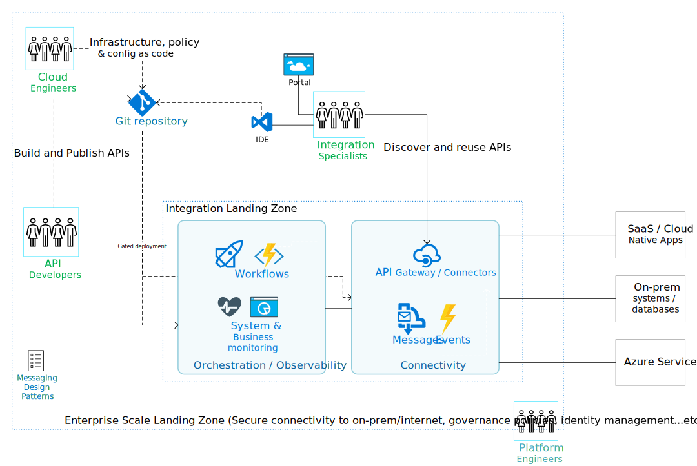

Azure Integration Serives (AIS) offer a modern hybrid integration solution. They integrate apps, data and processes across on-prem and cloud environments.

To help create well-architected AIS solutions, this guide will highlight:

1. [The main components and interactions of an AIS solution](#1-ais-in-motion)
2. [The key design areas and decisions for AIS](#2-key-design-areas)
3. [Demos to help teams get started](#3-key-demos)

## 1. AIS in motion

### Provision infrastructure, policy and config as code [Cloud Engineers]

- Cloud Engineers provision infrastructure ideally through code: ARM, Bicep or Terraform
- Infrastructure resources include but not limited to API Management instance, Logic Apps environment, Service Bus Namespace, Azure Monitor dashboards and alerts
- Azure Policies are created to govern usage. For example, one policy can block access to specific connectors like Dropbox. Another policy could restrict network access to workflows or APIs through private endpoints only
- Infrastructure defined as code has settings and parameters set per environment (dev, staging and prod environment)
- Permissions and AAD roles are defined for API Developers, App Developers, Integration Specialists and possibly partners

### Build and Publish APIs [API Developers]

- API Developers are ideally given access to Dev or Pre-Prod API Management instances
- They author APIs through IDEs or using Azure Portal
- They publish their APIs to the Prod API Management instance through Git Pull Requests or through pre-defined permissions to specific APIs
- A CI/CD pipeline pushes the API definitions and policies into production passing through any needed approvals or Pre-Prod environments. The pipeline definition can be created by Cloud Engineers

### Build Workflows [Integration Specialists]

- Integration Specialists build Logic Apps workflows through code or visually in IDE or Azure Portal. [More details can be found here](./workflow-dev.html)

- After local testing they push their workflows to a Git repository
- A CI/CD pipeline pushes the workflows through checks and gates passing by Pre-Prod environment into a Prod environment. The pipeline definition can be created by Cloud Engineers
- Workflows use connectors but also can consume organization APIs or communicate to other systems through Messages or Events
- Besides workflows, applications and systems can be integrated directly through queues, topics and events. However, adding Logic Apps workflows to the mix offers convenience of message pushing rather than polling, as well as low-code processing
- Integration Specialists can use Azure Monitor to monitor and get alerts on the system and business operations. This is in addition to pre-defined dashboards and alerts. [More details can be found here](./workflow-monitoring.html)

### Discover and use APIs [Partners and App Developers]

- App Developers in the organization or in a partner organization might need access to specific APIs
- The APIs defined by API Developers are published to a Developer Portal
- App Developers can discover APIs, understand request and response payloads and try out the APIs
- App Developers consume their APIs in their applications
- Integration Specialists also discover and use APIs in their workflows
- App Developers can integrate their apps through messaging technologies as well as APIs

### Provide a secure Landing Zone [Platform Engineers]

- All the above integration activities ideally run within an Integration Landing Zone provisioned and managed by Platform Engineers
- The Landing Zone has identity management controls (e.g. MFA and RBAC), org wide policies (e.g. encryption and tagging), connectivity (e.g. VPNs and firewalls) and more
- It has all the guardrails and controls to control spend, security, compliance and more
- Platform Engineers are part of a central team that operates several other landing zones for data, cloud native apps, infrastructure...etc.

## 2. Key Design Areas

### Resource Organization and Centricity

- Consideration: Will I have one central Integration team/environment(subscription) or will I push some integrations down to app or business teams?

  - There are pro/cons to each direction:

    - Centralized Integration
    - Easier to maintain and monitor
    - Can hit platform limits faster
    - Some roles or resources can introduce bottlenecks or single points of failure
  - Hybrid/Decentralized Integration
    - Provides more agility and autonomy to app/business teams
    - Might be an overkill for a small organization or low number of integration workloads
    - Clear ownership of data and integrations by app/business teams
    - Requires more standardization and automation across app/business teams

### Security and Roles

- Consideration: Will the "Ops" roles like Cloud Engineer and "Dev" roles like Integration Specialists be part of the same team?

  - Usually the organization DevOps maturity level can play a role in defining teams structure and responsibilities

- Consideration: Will the "Ops" roles be replicated across team in case of a hybrid/decentralized environment?

- Consideration: Do I have members with skills to play more than one role simultaneously?

- Consideration: What RBAC permissions will be given to each role and what system identities (Managed Identities) are needed

- Consideration: What authentication mechanisms will be used: OAuth2, Managed Identities...etc.?

### Connectivity

- Consideration: What are the network access requirements? Is all traffic coming from on-prem or from with Azure?
- Different Azure technologies will help in each network access use case:
  - Private Endpoint: Workflows or APIs expose private IP endpoints
  - Private DNS: Because some endpoints expose private IPs, a DNS resolution mechanism from within Azure or on-prem is needed
  - VNET integration: If workflows or APIs require access to virtual network resources, they need to be injected into the same or a peered virtual network
  - VPN or ExpressRoute: How are on-prem and Azure networks connected?
  - Firewall: Do I need to reach Azure endpoints or egress to internet/on-prem through firewalls?

### Governance and patterns

- Consideration: Do we have a list of automated governance policies that get reviewed regularly?
- Consideration: Do we have teams trained and in agreement on [Cloud Messaging Patterns](https://docs.microsoft.com/en-us/azure/architecture/patterns/category/messaging) and how to select the right integration technology?

### Observability

- Consideration: Do our technical teams have enough visibility into systems and integration workloads health?
- Consideration: Do business teams have the right access into business activities health with an option to re-submit or retry failed workflow?
- Consideration: Do we have the right alerts and are they reaching the right audience, through the right channel, and at the right frequency?

## 3. Key Demos

- [API Management DevOps Resource Kit](https://github.com/Azure/azure-api-management-devops-resource-kit)
- [Logic Apps (Workflows) DevOps - Credits: Bec Lyons](https://github.com/Bec-Lyons/LogicAppsDevOps)
- [Logic Apps Observability - Credits: Paco de la Cruz](https://github.com/pacodelacruz/observability-pubsub-logicapps)

## Feedback and Contribution

For feedback and contributions, please open a [GitHub issue](https://github.com/melzayet/ais-design-guide/issues)