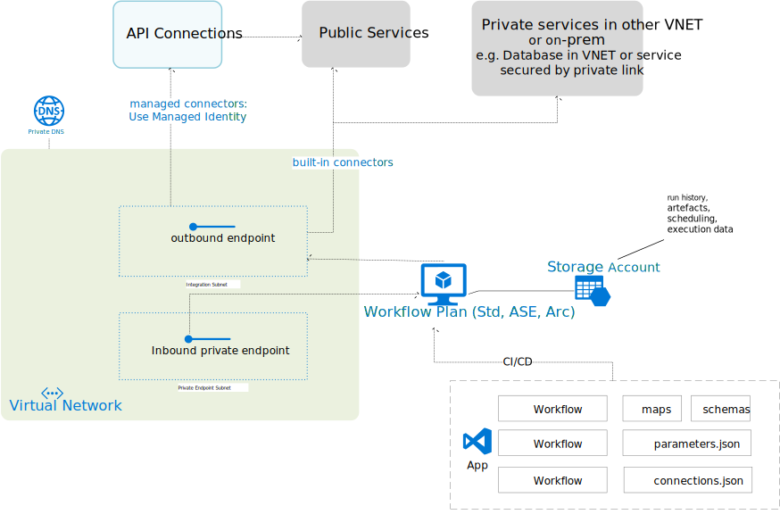

**Networking options in Logic Apps (Standard)**

[back](./)

### 1. Inbound Access

- Optionally a private endpoint can be used to access the Logic Apps management and data places

- A VPN/ER connection will be required to trigger request based workflows, manage workflows or view workflows in the portal

### 2. Outbound Access

- Storage Account can be accessed through a private connection

- Access to outside resources will leverage subnet's user-defined routing (UDR), Network Security Group (NSG) or VNET-linked private DNS Zones

[back](./)
