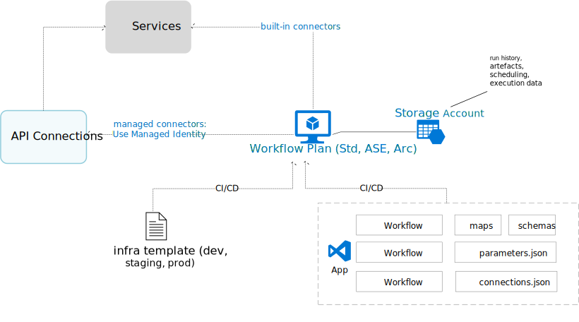

**Overview of Logic Apps (Standard)**

[back](./)

### 1. Connector Types

- API Connections: Managed connectors by Azure and require Managed Identity to be enabled on the Logic Apps instance

- Built-in Connector: Runs within the Logic Apps runtime, thus providing better performance and can access resources with private endpoints

### 2. Authoring and Management

- Infrastructure including the workflow plan and storage account can be authored using Infrastructure as Code templates

- App components like workflow definitions, connections, parameters, maps and schemas can be deployed separated as a ZIP package

- Different teams can own the infrastructure and app components

[back](./)
