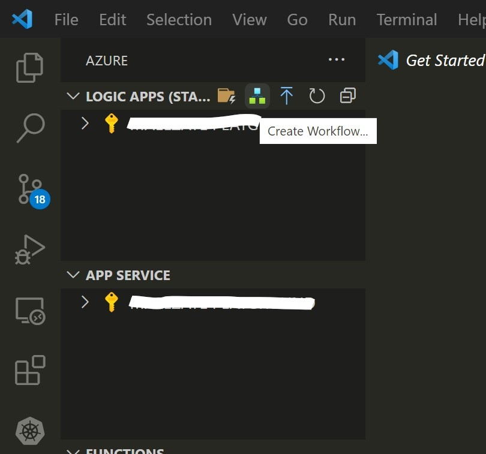
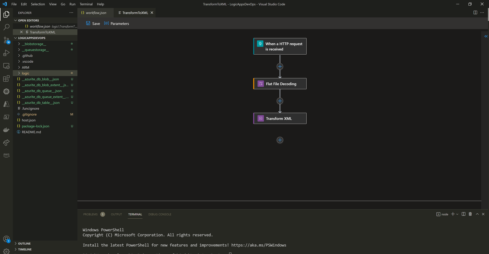
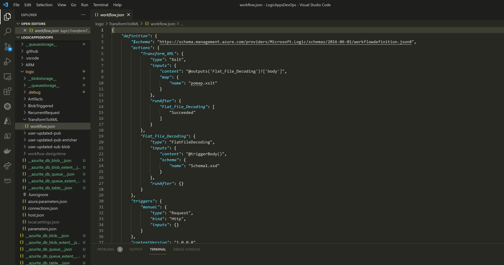
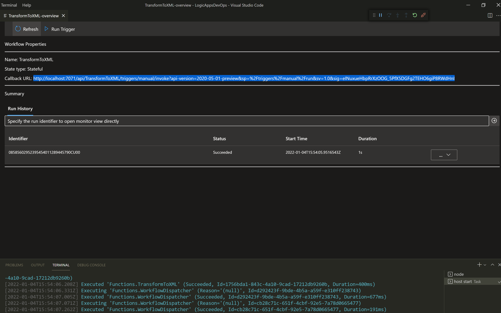
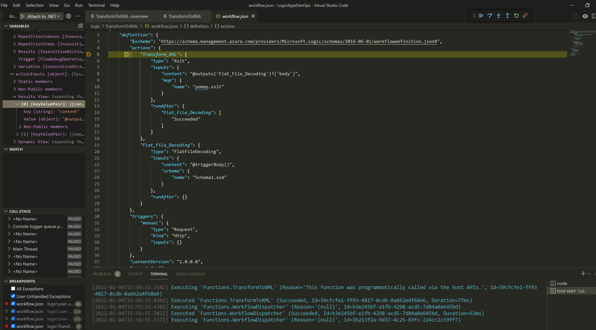

**Developing Integration workflows using Logic Apps (Standard)**

[back](./)

### 1. Local Authoring using VS Code

- New workflows can be created through Azure VS Code plug-in

- Each workflow can be designed visually

- Changes that are easier to do in code can be performed in code view (JSON)

### 2. Local Testing & Debugging using VS Code

- Test workflows using local endpoints

- Debug workflows using breakpoints

[back](./)