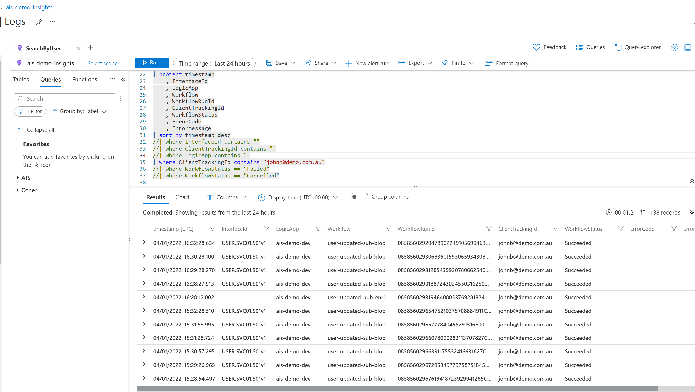
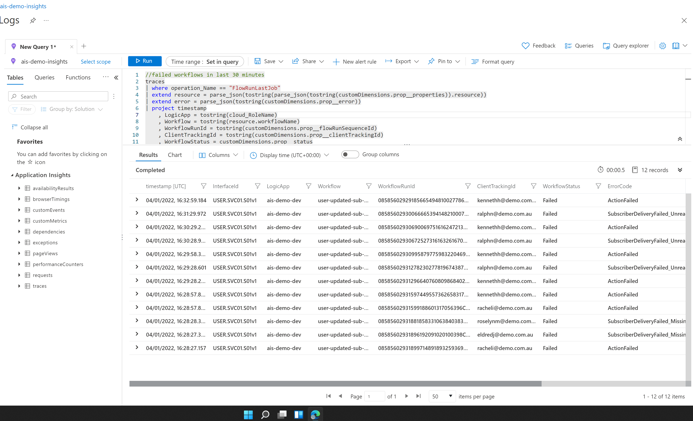
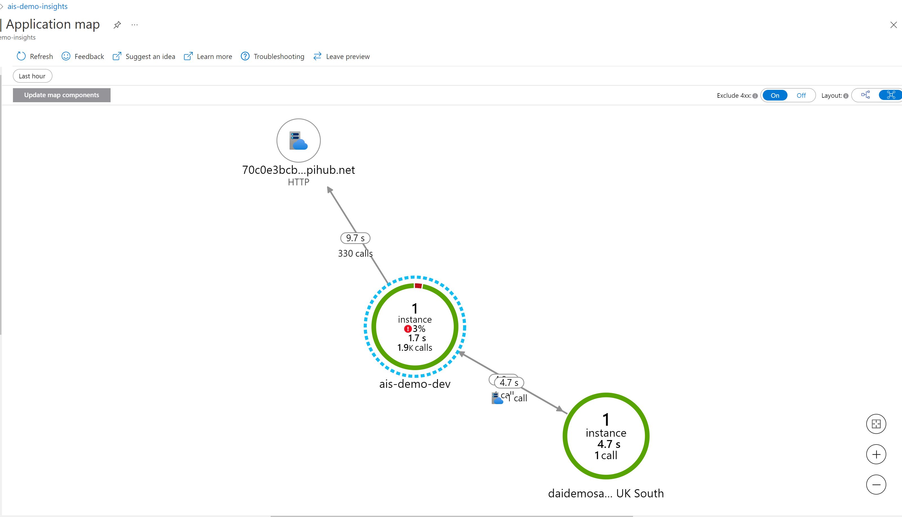
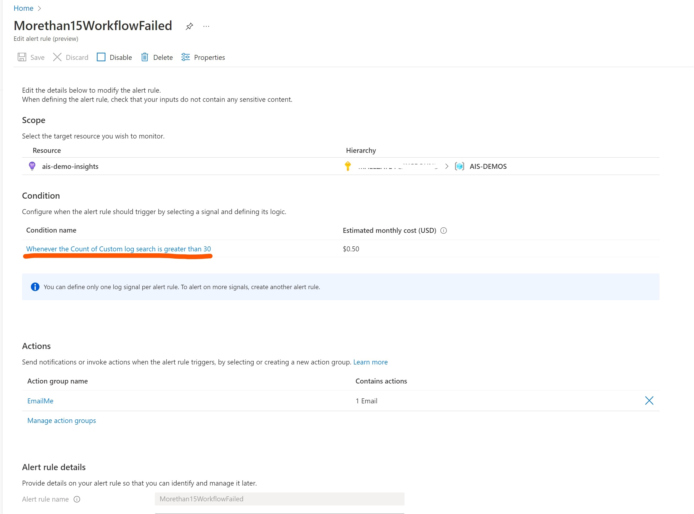

Monitoring Integration workflows - Logic Apps (Standard)

[back](./)

### 1. Query logs and metrics

- Logs can be queried by workflow client tracking id, for example: username or email

- Logs can be queried by workflow data or status

### 2. Using Application Insights to trace integration components

- Performance and failures can be investigated using map for app components

### 3. Setting Alerts

- Alerts can be set on system metrics or on query results (e.g., a query returns more than 10 workflows failed in last hour)

[back](./)